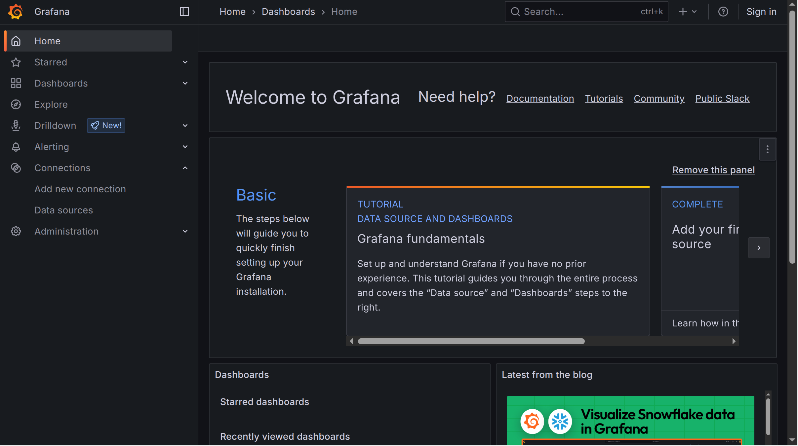
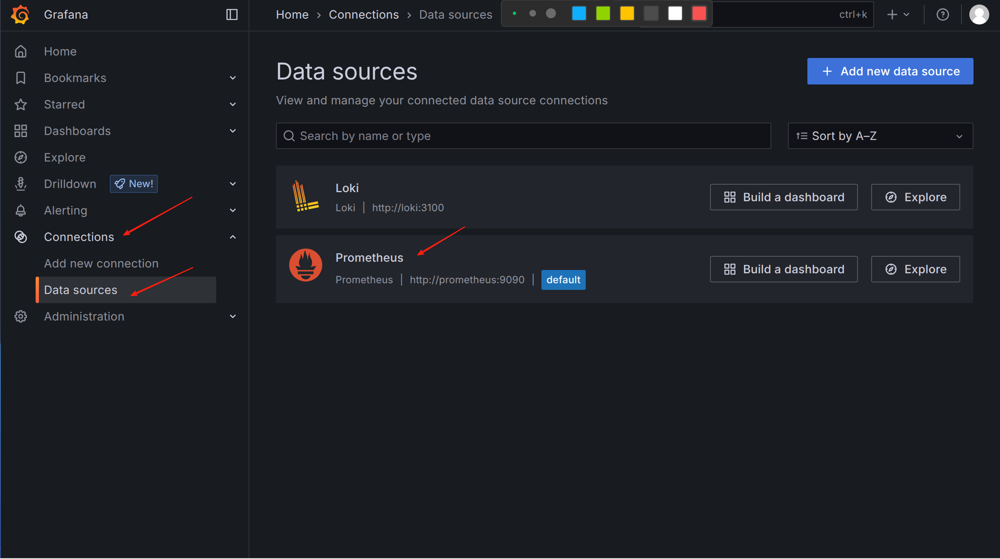
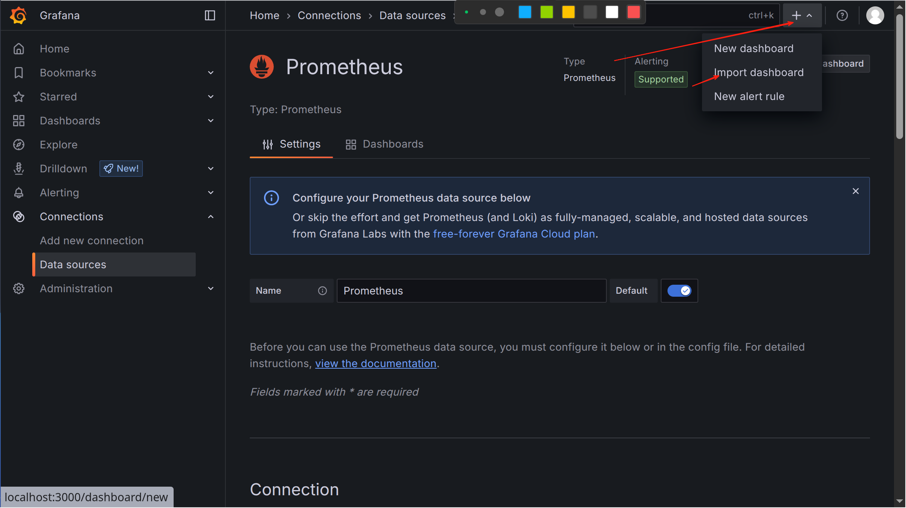
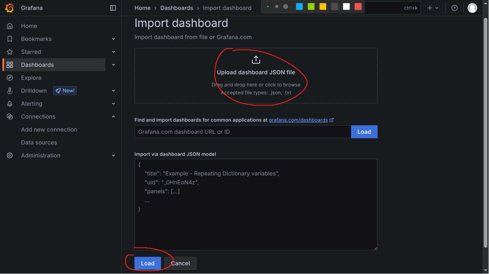
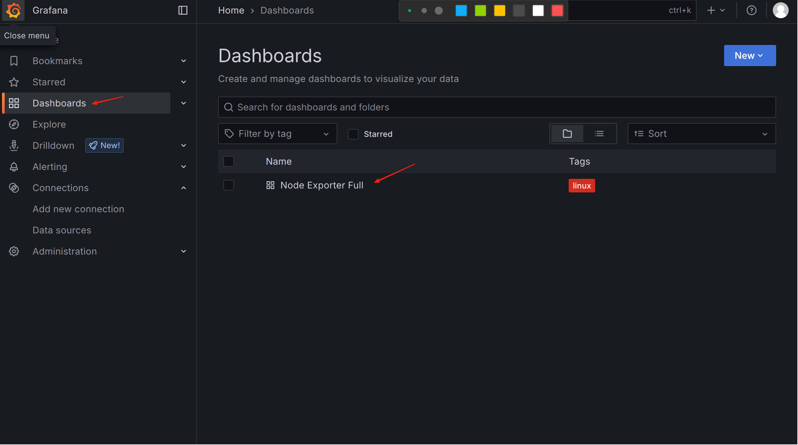
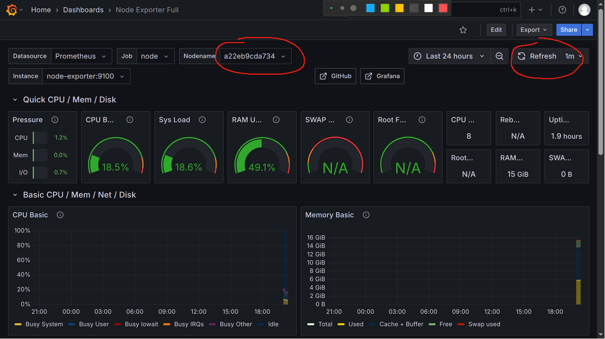

# 使用 GLP 等进行系统监控

## 主要使用工具 
Prometheus / Grafana  / Loki   /Node-exporter /  Promtail  / Docker Compose

### 安装步骤

1. 安装docker compose 

2. 准备配置文件，映射到容器中

   **loki-config.yml**, => **/opt/apps/loki/loki-config.yaml**  
   **prometheus.yml**, => **/opt/apps/prometheus/prometheus.yml**  
   **promtail-config.yml**, => **/opt/apps/promtail/promtail.yml**

   或者也可以更改 [docker compose文件](yml-config/docker-compose.yml) 下的每个容器的Volumns的配置文件映射

   并创建 **/opt/apps/grafana/grafana-storage/** 目录

3. 为 Grafana 创建目录，映射到容器中，指定用户和组，以便映射到容器中后有权限

```bash
sudo mkdir -p /opt/apps/grafana/grafana-storage
sudo chown -R 472:472 /opt/apps/grafana/grafana-storage
```

3. 使用 [docker compose文件](yml-config/docker-compose.yml) 启动容器
   ```bash
   sudo docker compose up -d
   ```
4. 查看容器是否启动成功 
   ```bash
   sudo docker ps 
   ```
5. 启动成功后，可以在 
    - [3000端口](http://localhost:3000) 查看 Grafana 服务
    - [9090端口](http://localhost:9090) 查看 Prometueus 服务
    - [9100端口](http://localhost:9100) 查看 Node-exporter 服务

### 配置 Grafana 

1. 打开[默认3000端口](http://localhost:3000)的页面，应该可以看到主页

   

   点击右上角的 **Log In** 登录，账号密码默认都为 **admin**,登录后推荐修改密码

2. 点击左侧 Connections => Data Sources,选择右侧 Prometheus

   

3. 选择右上角加号，**Import Dashboard**，进行模板导入

   

4. 上传模板，项目中有一个从官网下载的，为K8s使用的默认模板 [json模板](./yml-config/template.json).此处可以直接使用，十上传后选择 **Load**.

   

5. 查看数据

   

6. 查看某个节点的数据

   

   在上方 **NodeName** 中，可以选择在 [Prometheus](./yml-config/prometheus.yml)中配置的 node 中的某个节点